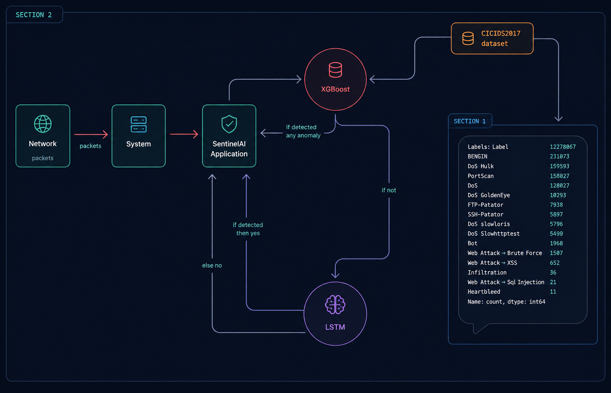

## SentinelAI — Real-Time Network Intrusion Detection System (NIDS)

#### **SentinelAI** is a modern, AI-powered Network Intrusion Detection System (NIDS) designed for real-time traffic monitoring and on-device anomaly detection.

Built with **Rust, Tauri, NFStream, and Machine Learning models**, SentinelAI provides powerful, low-latency threat detection without sending any data outside the user's machine.

#

### ◈ Features

#### Real-Time Network Monitoring

- Captures live traffic from all active network interfaces.
- Displays interface details (name, ID, bandwidth, flow stats, etc.).
- Built with **Npcap** and **NFStream** for high-performance packet capture.

#

#### AI-Powered Intrusion Detection

- Hybrid AI Engine: **XGBoost Multi-Class Classifier** and **LSTM Autoencoder (ONNX)**.
- Analyzes over **80+ flow-based features** for deep inspection.
- Hybrid decision system provides high accuracy and extremely low false positives.

#

#### Local Processing

- **No data ever leaves your system.**
- All models run completely on the user's machine.
- Ideal for personal use, developers, researchers, and secure enterprise environments.

#

#### Desktop Interface

- Lightweight, fast, and responsive native Windows application.
- Provides real-time charts, alerts, and detailed interface statistics.

#

### ◈ Installation

Follow these steps to get SentinelAI running.

#

#### 1. Install Npcap (Required)

SentinelAI **requires** Npcap to be installed on your system for packet capturing.

> **Warning:** This is a mandatory step. The application will not function without Npcap.

1. Visit the official Npcap download page.
2. Download and run the latest installer.
3. During installation, it is recommended to enable **"Install Npcap in WinPcap API-compatible Mode"** for maximum compatibility.

#

#### 2. Download SentinelAI

1. Go to the **Latest Release** page.
2. Download the `.msi` installer from the **Assets** section.

#

#### 3. Run the Application

1. Run the downloaded installer (`SentinelAI_1.0.0_x64-setup.msi`).
2. Launch SentinelAI. It will automatically detect your interfaces and be ready to begin monitoring.

#

### ◈ Machine Learning Engine

SentinelAI uses a hybrid decision engine to combine signature-based and anomaly-based detection, ensuring high accuracy while minimizing false positives.

#

#### Models Used

- **XGBoost Classifier:** A multi-class classifier trained on known threat patterns and flow behaviors. Optimized for very low inference latency.
- **LSTM Autoencoder (ONNX):** Detects novel, unseen anomalies. It learns to reconstruct normal network flows and flags significant reconstruction errors as potential threats.

#

#### Data & Features

All analysis is performed locally using over **80+ engineered features** extracted in real time by **NFStream**, including:

- Flow duration
- Packet/Byte counts
- Source/Destination ports
- TCP flags
- Payload entropy
- Packet & byte rates
- Inter-arrival times
- Protocol metadata

#

### ◈ Project Structure

#

### ◈ Reporting Issues

If you encounter any bugs or have suggestions for improvements, please open an issue.

#

### ◈ Acknowledgements

Special thanks to:

- The **Npcap** team for the packet capture library.
- The **NFStream** team for the high-speed flow extraction.
- The **ONNX Runtime** team.
- All contributors and testers.

#

### ◈ License

This project is licensed under the **MIT License**. See the `LICENSE.md` file for details.
